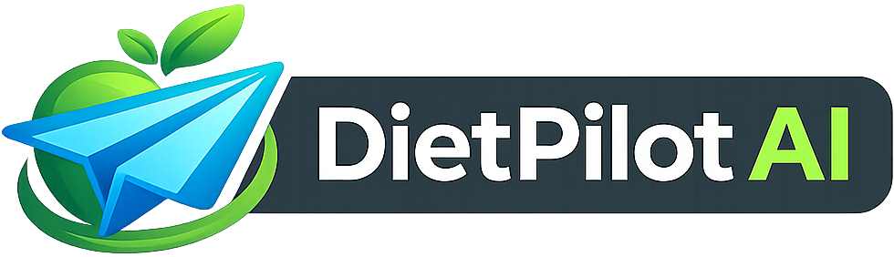
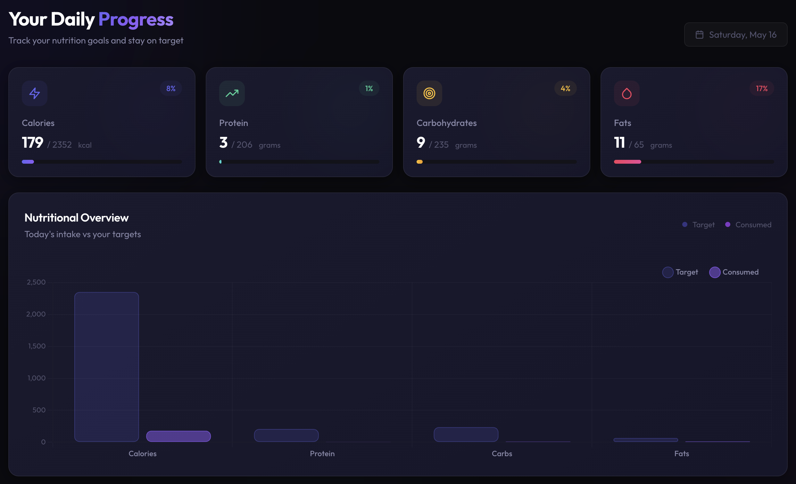
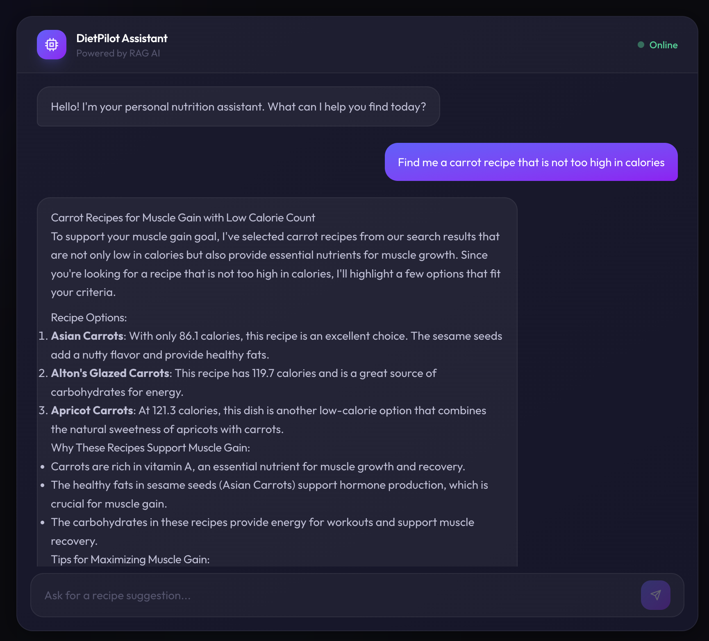
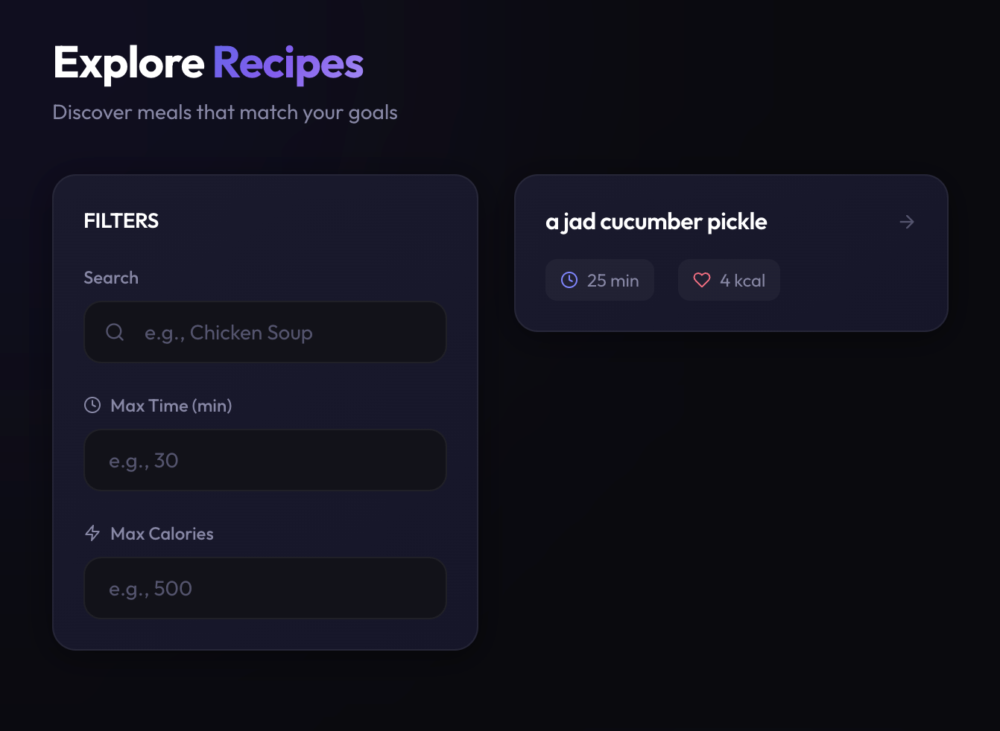
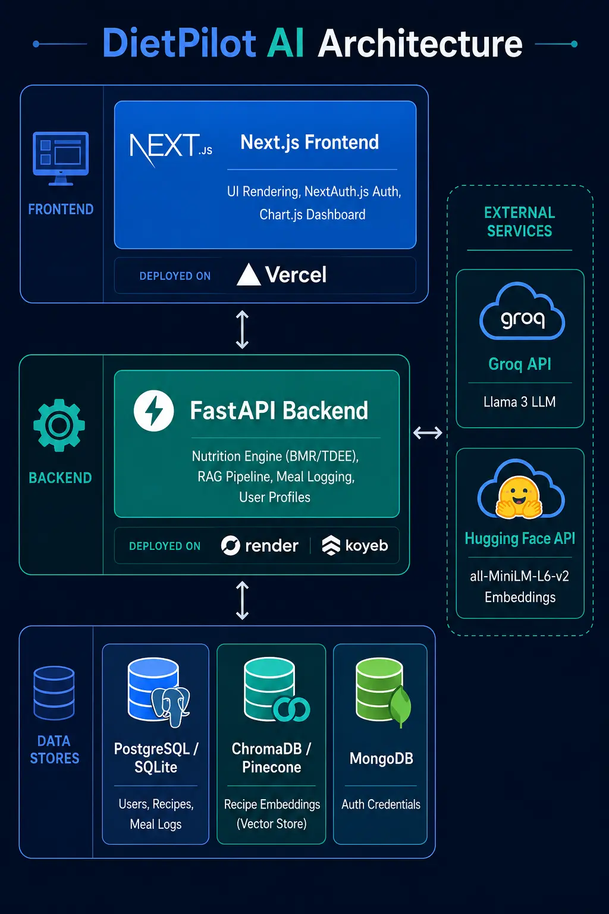

<div align="center">
  
</div>

<br/>

# Smart Nutrition & Recipe Companion

An end-to-end web application that combines Retrieval-Augmented Generation (RAG), personalized health tracking, and a modern full-stack architecture to deliver tailored meal recommendations.

[Getting Started](#getting-started-local-demo) · [Features](#feature-breakdown) · [Screenshots](#screenshots) · [Tech Stack](#tech-stack) · [Architecture](#system-architecture) · [Roadmap](#roadmap)


https://github.com/user-attachments/assets/82795fca-0441-4a11-8b74-cb2c693b4791

---

## What is DietPilot AI?

DietPilot AI acts as a personal nutrition coach in your browser. Instead of manually searching for recipes that fit your macros, you interact with an AI assistant that understands your dietary goals and suggests meals accordingly, all through a simple chat interface.

The project demonstrates several core capabilities:

- **Conversational AI with RAG:** Leverages LLMs and semantic search to interpret natural-language queries and surface relevant recipes.
- **Individualized Nutrition Planning:** Computes your BMR, TDEE, and macro targets based on your profile, then aligns every recommendation with those numbers.
- **Modern Full-Stack Architecture:** A Next.js frontend paired with a FastAPI backend, connected through RESTful APIs.
- **Persistent Data Management:** Stores user profiles, meal logs, recipes, and conversation history across sessions.

---

## Getting Started (Local Demo)

### 1. Clone the Repository

Clone this repository to your local machine.

### 2. Download the Recipe Dataset

Grab the [Food.com Recipes and Interactions](https://www.kaggle.com/datasets/shuyangli94/food-com-recipes-and-user-interactions) dataset from Kaggle, then place the extracted `recipes.csv` inside the backend directory.

### 3. Backend Setup

```bash
# Create and activate a virtual environment
python3 -m venv venv
source venv/bin/activate

# Install Python dependencies
pip install -r requirements.txt
```

Create a `.env` file (refer to `.env.example` if available) and fill in your Groq and Hugging Face API keys. Set `DATABASE_URL` to a SQLite path, e.g. `sqlite:///dietpilot.db`.

```bash
# Initialize and seed the database, then start the server
python create_db.py
python load_data.py
uvicorn app.main:app --reload
```

### 4. Frontend Setup

```bash
# Install Node dependencies
npm install
```

Create a `.env.local` file (see `.env.local.example`) with:

- `NEXTAUTH_SECRET`
- Your Google OAuth credentials
- `NEXT_PUBLIC_API_URL=http://127.0.0.1:8000`

```bash
# Start the development server
npm run dev
```

Open [http://localhost:3000](http://localhost:3000) in your browser to start using DietPilot AI.

---

## Feature Breakdown

### 1. Authentication & Security

Complete sign-up and login flow powered by NextAuth.js, supporting both credential-based and Google OAuth methods.

### 2. Personalized Onboarding Flow

New users provide their height, weight, age, activity level, and health objective. The built-in Nutrition Engine uses these inputs to calculate daily calorie and macro targets.

### 3. AI-Powered Chat Assistant (RAG)

- Ask questions in plain English, for example, _"Suggest a high-protein breakfast under 400 calories."_
- **Retrieval step:** Recipe embeddings (generated via Hugging Face) are compared against your query using a vector store (ChromaDB for the local demo; Pinecone-ready for production).
- **Augmentation step:** Matching recipes are enriched with full ingredient and nutrition data pulled from the relational database.
- **Generation step:** A large language model (Llama 3 via Groq) crafts a natural, goal-aware response that references your specific targets.
- **Conversation memory:** The assistant retains chat context, so follow-ups like _"Make it gluten-free"_ work seamlessly.

### 4. Live Nutrition Dashboard

Track your daily intake of calories, protein, carbs, and fats against your personal goals through interactive Chart.js visualizations that update whenever you log a meal.

### 5. Recipe Discovery

Browse the full recipe catalog with search, calorie caps, and prep-time filters. Paginated results keep navigation smooth even with large datasets.

### 6. Recipe Details

Each recipe card opens into a comprehensive view listing every ingredient and step-by-step cooking instructions.

### 7. One-Click Meal Logging

Log any recipe as a meal straight from its detail page. Nutritional data is automatically credited to your daily dashboard totals.

---

## Screenshots

### Dashboard



### AI Chat Interface



### Recipe Exploration



---

## Tech Stack

| Layer          | Technologies                                                                                                                              |
| -------------- | ----------------------------------------------------------------------------------------------------------------------------------------- |
| **Frontend**   | Next.js (App Router), React, Tailwind CSS, daisyUI, Chart.js, Framer Motion, react-markdown                                               |
| **Backend**    | FastAPI, Python, SQLAlchemy                                                                                                               |
| **AI / RAG**   | Llama 3 (Groq API), all-MiniLM-L6-v2 embeddings (Hugging Face Inference API), ChromaDB (local) / Pinecone (production concept), LangChain |
| **Auth**       | NextAuth.js (Credentials + Google OAuth)                                                                                                  |
| **Databases**  | SQLite (local demo) / PostgreSQL (Neon/Supabase for production), MongoDB (NextAuth adapter)                                               |
| **Deployment** | Vercel (frontend concept), Render / Koyeb / Fly.io (backend concept), currently configured for local use                                  |

---

## System Architecture

<div align="center">
  
</div>

The application follows a loosely coupled, services-oriented design:

**Next.js Frontend:** Renders every UI screen and manages session state through NextAuth.js.

**FastAPI Backend:** A standalone service that handles:

- User profile and goal management
- Nutritional computation (BMR, TDEE, macros)
- RAG pipeline orchestration (embedding lookup → data fetch → LLM prompt)
- Meal log persistence and chat history storage

**Data Stores:**

- **Relational DB (SQLite / PostgreSQL):** Structured records: users, recipes, meal logs.
- **Vector Store (ChromaDB / Pinecone):** Semantic recipe embeddings for fast similarity search.
- **MongoDB:** Authentication data managed by the NextAuth adapter.

This separation keeps each concern independent, making the system easier to scale and maintain.

---

## Roadmap

- Deploy to cloud infrastructure (Vercel + Neon/Supabase + Pinecone + Render).
- Build a Pantry Scanner using computer vision to detect ingredients you already have.
- Auto-generate Smart Shopping Lists based on your weekly meal plan.
- Expand recipe filtering with cuisine type, dietary tags, and allergen controls.
